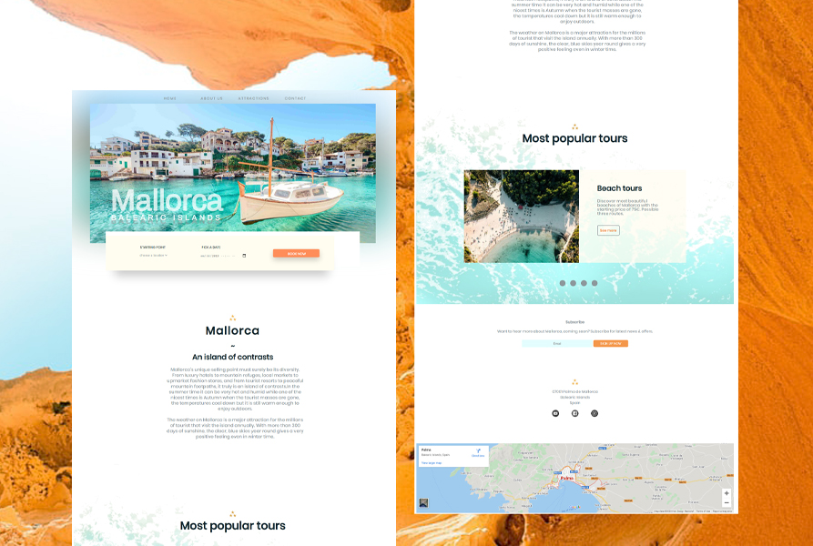

# Website project

This is a HTML, CSS only website, moreover, my first project ever done. During my enrollment in programming academy, I had only fifteen days to make a responsive website.
Looking it now, I had many mistakes but in those fifteen days I was trying to incorporate more complex CSS code into my project, but at the end it wasn't that valued.
I am proud to say that my first website is my handwork, it is not a downloaded template. 

After some time, I decided to redesign the project. I choose more sophisticated typeface, simplified the design. I also left some elements that represent my first efforts in web design, like CSS only slider and burger bar.
Website is a small and short presentation of an island of Mallorca where you can order your tours and get to know island better.

* Project name: __HTML, CSS only website__
* Project technologies: __HTML, CSS__
* Project status: finished
* Devices: __mobile, tablet, desktop__

by Elma Mehmedić
